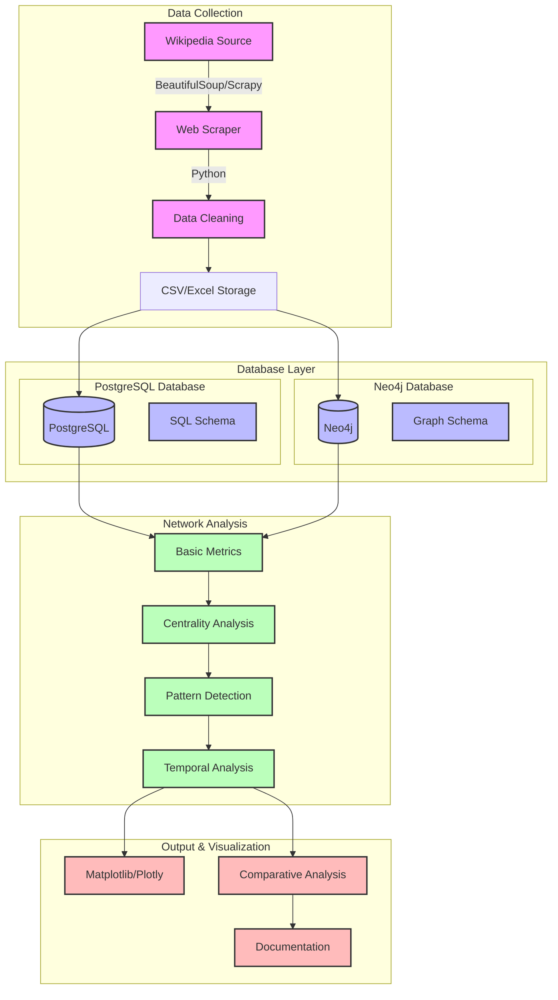

```mermaid
flowchart TB
    subgraph Data_Collection["Data Collection"]
        WS[Wikipedia Source] --> |BeautifulSoup/Scrapy| SC[Web Scraper]
        SC --> |Python| DC[Data Cleaning]
        DC --> CSV[CSV/Excel Storage]
    end

    subgraph Database_Layer["Database Layer"]
        subgraph SQL_DB["PostgreSQL Database"]
            PG[(PostgreSQL)]
            PGS[SQL Schema]
        end
        
        subgraph Graph_DB["Neo4j Database"]
            NEO[(Neo4j)]
            GS[Graph Schema]
        end
    end

    subgraph Analysis["Network Analysis"]
        BM[Basic Metrics]
        CA[Centrality Analysis]
        PD[Pattern Detection]
        TA[Temporal Analysis]
    end

    subgraph Visualization["Output & Visualization"]
        VIZ[Matplotlib/Plotly]
        DOC[Documentation]
        COMP[Comparative Analysis]
    end

    %% Connections
    CSV --> PG
    CSV --> NEO
    PG --> BM
    NEO --> BM
    BM --> CA --> PD --> TA
    TA --> VIZ
    TA --> COMP
    COMP --> DOC

    %% Styling
    classDef primary fill:#f9f,stroke:#333,stroke-width:2px
    classDef secondary fill:#bbf,stroke:#333,stroke-width:2px
    classDef tertiary fill:#bfb,stroke:#333,stroke-width:2px
    classDef output fill:#fbb,stroke:#333,stroke-width:2px

    class WS,SC,DC primary
    class PG,NEO,PGS,GS secondary
    class BM,CA,PD,TA tertiary
    class VIZ,DOC,COMP output
```

